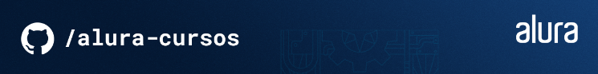

# 🌐 Plantilla para Portafolio Personal

---

¡Bienvenido a mi repositorio! Este proyecto es una **plantilla de portafolio personal** que he creado como base para diseñar y construir un sitio web responsivo. Este proyecto está inspirado en un **mockup de Figma** (puedes verlo aquí: [[Link al Mockup de Figma](https://www.figma.com/design/ngAigJ3TPz7NaMMt09vmvR/Portafolio---Curso-3-Responsio?node-id=0-1&t=Y1X8iEYXYLt7GNFO-1)]). Fue diseñado para ser una estructura flexible y personalizable, perfecta para quienes desean tener su propio portafolio online.

## 📑 ¿Qué es este proyecto?

Este repositorio contiene la estructura de un **portafolio personal responsivo**. Consta de un diseño limpio y moderno, adaptado para que puedas agregar fácilmente tu información personal, proyectos, habilidades, redes sociales y tu CV. La idea es proporcionar una base sobre la que puedas construir y personalizarla según tus necesidades.

### Funciones destacadas:

- **Diseño completamente responsivo:** Se adapta a cualquier dispositivo (móviles, tabletas, y PC).
- **Estructura modular:** Fácil de personalizar y expandir según tus proyectos y objetivos.
- **Enlaces a redes sociales:** Conecta tu portafolio con tu presencia online.
- **Sección de CV:** Muestra tu experiencia profesional y habilidades.
- **Inspirado en una mockup de Figma:** Diseño visual detallado y bien estructurado.

## 🔧 Tecnologías utilizadas

Este proyecto utiliza tecnologías web estándar para garantizar la mejor compatibilidad y rendimiento:

- **HTML5:** Estructura básica de la página.
- **CSS3** (Flexbox): Diseño responsivo y moderno.
- **JavaScript** (opcional): Para funcionalidades interactivas y dinámicas.

## 📐 ¿Cómo empezar?

1. **Clona este repositorio** a tu máquina local usando:

```bash
git clone https://github.com/tu-usuario/tu-repositorio.git
```

2. **Abre el proyecto** en tu editor de código favorito (por ejemplo, Visual Studio Code).

3. **Personaliza el contenido:**

    - Edita los archivos HTML para agregar tu información personal, proyectos y CV.
    - Personaliza los estilos en los archivos CSS para que coincidan con tu marca personal o preferencias.

4. **¡Listo!** Ya tienes una base para tu portafolio personal.

## 🖥️ Mockup de Figma

Este proyecto está basado en la siguiente mockup de Figma. Si quieres ver cómo se planeó el diseño, visita el enlace:

[Enlace al Mockup de Figma](https://www.figma.com/design/ngAigJ3TPz7NaMMt09vmvR/Portafolio---Curso-3-Responsio?node-id=0-1&t=Y1X8iEYXYLt7GNFO-1)

## 💡 Ideas para personalizar

- Agregar una **sección de proyectos** para mostrar tu trabajo de manera atractiva.
- Incluir una **sección de testimonios** si tienes recomendaciones de colegas o clientes.
- Modificar el **tema de color** para reflejar tu identidad visual.
- Incorporar **efectos de animación** usando JavaScript o CSS para hacer la experiencia más dinámica.

## 🌍 ¿Por qué esta plantilla?

Este proyecto fue pensado para que cualquier persona, ya sea un desarrollador, diseñador, o profesional de cualquier campo, pueda tener un portafolio online sin tener que comenzar desde cero. Es la base perfecta para quienes buscan una forma rápida y eficiente de mostrar su trabajo al mundo.

## 📜 Licencia

Este proyecto está bajo la **Licencia MIT**. Si deseas modificar o distribuir este código, siéntete libre de hacerlo. Solo asegúrate de dar crédito donde corresponde.

> Este proyecto se basa en los conocimientos adquiridos en el curso de Alura Latam. Agradezco a la plataforma por proporcionar las herramientas necesarias para crear este portafolio.

---

**¡Gracias, Alura Latam!** 🚀